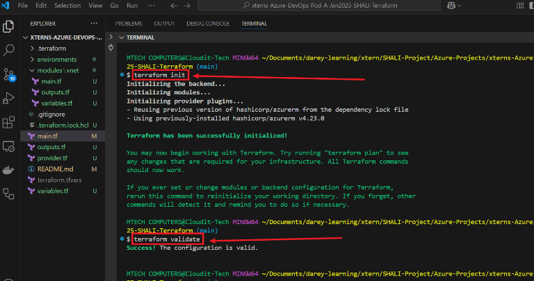

# Azure Virtual Network (VNet) Terraform Module

## 📖 Introduction:
This project provides a step-by-step guide to developing a reusable Terraform module for provisioning `Azure Virtual Networks (VNets)` in **multiple environments** — `sandbox`, `staging`, and `production` — under the `externs-pod` resource group within a single Azure subscription. The project emphasizes **Infrastructure as Code (IaC)** practices, enabling consistent, scalable, and automated VNet deployments while applying best practices for environment isolation, reusability, and maintainability.

## 🎯 Objectives:
✅ To build a reusable and scalable Terraform VNet module for Azure.

✅ To demonstrate environment-specific deployments (sandbox, staging, production) using .tfvars.

✅ To implement secure and efficient Azure authentication for Terraform without hardcoding sensitive data.

✅ To troubleshoot common errors during Terraform deployment and understand their solutions.

✅ To enhance infrastructure automation skills using Terraform and Azure CLI.

## ⚙️ Technology/Tools Used:
- **Azure Cloud Platform** – For provisioning Virtual Networks.
- **Terraform v1.x** – For Infrastructure as Code (IaC) and resource automation.
- **Azure CLI (az)** – For authenticating and interacting with Azure.
- **Terraform Azure Provider (azurerm >= v3.x)** – Terraform plugin for Azure Resource Manager.
- **Visual Studio Code (VS Code)** – For writing and organizing Terraform code.
- **Git/GitHub** – For version control and collaboration.

Step-by-step guide to develop an Azure Virtual Network (VNet) Terraform module using the **xterns-pod** resource group for different environments **(sandbox, staging, and production)** within a single Azure subscription.

## Step 1: Prerequisites

Before starting, ensure you have the following:

✅ An active Azure subscription

✅ Azure CLI installed **(az version to check)**

✅ Terraform installed **(terraform -v to check)**

## Step 2: Authenticate to Azure

1. Check your current subscription: ```az account show```

    

2. Switch to the subscription: ```az account set --subscription "<SUBSCRIPTION_ID>"```

3. To confirm that you have successfully switched to the desired Azure subscription, run the following command:

    ```
    az account show --output table
    ```

    

## Step 3: Set Up the Project Structure

Create the following folder structure:

```
xterns-Azure-DevOps-Pod-A-Jan2025-SHALI-Terraform/
│── environments/         # Environment-specific configurations
│   ├── sandbox.tfvars
│   ├── staging.tfvars
│   ├── prod.tfvars
│── modules/              # Reusable Terraform module
│   ├── vnet/
│   │   ├── main.tf
│   │   ├── variables.tf
│   │   ├── outputs.tf
│── main.tf               # Calls the module
│── variables.tf          # Global variables
│── outputs.tf            # Output values
│── provider.tf           # Azure provider configuration
│── terraform.tfvars      # Default values
│── README.md             # Documentation

```

## Step 4: Configure the Azure Provider

Create a file called `provider.tf` to configure Terraform to use Azure.


 This ensures Terraform can interact with Azure Resource Manager (ARM).

 ## Step 5: Create the VNet Module

 Navigate to `modules/vnet/` and create `main.tf`.


This defines a **VNet** using the available **externs-pod** resource group.

## Step 6: Define Module Variables

Create `modules/vnet/variables.tf.`


This defines input variables for the module.

## Step 7: Define Module Outputs

Create `modules/vnet/outputs.tf`.


This allows us to **view** details of the created VNet.

## Step 8: Use the VNet Module in `main.tf`

Go to the **root directory** and create`main.tf`.


This **calls** the **VNet module** and passes the required variables.

## Step 9: Define Global Variables in `variables.tf`

Create `variables.tf` in the root directory.


These variables will be used across all environments.

## Step 10: Define Environment-Specific Configurations

Navigate to `environments/` and create `sandbox.tfvars`, `staging.tfvars`, and `prod.tfvars`.


1. **Sandbox** (`environments/sandbox.tfvars`)

    

2. **Staging** (`environments/staging.tfvars`)

    

3. **Production** (`environments/prod.tfvars`)

    

These files **define different** **VNets** for **each environment.**

## Step 11: Initialize Terraform

Run Terraform initialization:

```
terraform init
```


This **downloads** necessary providers and modules.

## Step 12: Validate Configuration

```
terraform validate
```

## ERROR:


The error **"Unsupported argument: resource_group_name"** means that Terraform does not expect `resource_group_name` inside the `module "vnet"` block. This happens because we did not define `resource_group_name` in the module's `variables.tf` file.

## Fix: Add `resource_group_name` to the Module

**Step 1:** Update `modules/vnet/variables.tf`


**Step 2:** Update `modules/vnet/main.tf`

Modify `modules/vnet/main.tf` to **use** the new variable.


**Step 3:** Update `main.tf` in the **Root Directory**

Go back to `main.tf` in the **root folder** and pass `resource_group_name` correctly.


**Step 4:** Re-run Terraform

```
terraform init   # Ensure everything is set up
terraform validate   # Check if the issue is resolved
```



Now, **terraform validate** should **work** **without errors**.

## Step 13: Deploy VNets

**Deploy the Sandbox Environment**

```
terraform apply -var-file=environments/sandbox.tfvars -auto-approve
```

## ERROR


The error message indicates that Terraform requires the `subscription_id` property for the Azure provider but it's missing from your configuration.

## Step-by-Step Solution

1.  **Modify** Your `provider.tf` File

Replace your current `provider.tf` configuration with the following:


This allows Terraform to use your existing **Azure CLI session** for **authentication**.

At this stage, I encountered the "Tenant Assignment Required" issue while trying to access the Azure environment for the Azure DevOps Xterns Project.

I attempted to log in using the command:

```
az login
```

However, I received the following error message:
*"The selected user account does not exist in the tenant 'Microsoft Services' and cannot access the application '29d9ed98-a469-4536-ade2-f981bc1d605e' within that tenant. The account must first be added as an external user in the tenant."*


## Solution

1. First, log in to the Azure Portal using your **default browser**.
2. Then, run the following commands in your terminal:

    ```
    az config set core.login_experience_v2=off
    az account clear
    az config set core.enable_broker_on_windows=false
    ```

3. After that, try running az login again.

    

    

4. **Confirm by Checking User Info**

    Run:

    ```
    az ad signed-in-user show
    ```

    

5. Run Terraform Again

Now, retry your Terraform command:

```
terraform apply -var-file=environments/sandbox.tfvars -auto-approve
```

## ERROR


This means that Terraform needs the Azure `subscription_id` in your provider `"azurerm"` block, and it's currently missing or not passed correctly during `terraform apply`.

## Possible Solution:
You need to define or pass the `subscription_id` in your `provider.tf` or ensure it's coming from your sandbox.tfvars file or `terraform.tfvars`.

## Adopted Solution

This solution was adopted because Hardcoding sensitive values like subscription_id, client_id, and client_secret is not recommended for security and maintainability reasons—especially when working in a team or pushing code to a repository.

Since we've already used `az login`, the best and safest method for our situation is to enable `Azure CLI authentication` in our `provider.tf`.

That way, Terraform automatically uses our active `Azure CLI` session—no need to **hardcode** `subscription_id`, `client_id`, `client_secret`, or `tenant_id`.

## Here’s What to Do Next

1. Update our `provider.tf` like this:

    ```
    provider "azurerm" {
    features = {}
    use_cli_auth = true
    }
    ```

    

2. Run Terraform commands as usual:

    ```
    terraform init
    terraform plan -var-file="prod.tfvars"
    terraform plan -var-file="sandbox.tfvars"
    terraform plan -var-file="staging.tfvars"
    terraform apply
    ```
## Error


## Root Cause:
I am using a newer version of the azurerm provider `(v3.x or higher)`, and:

- `features = {}` should be a block, not an argument.
- `use_cli_auth = true` is **deprecated/removed** in newer provider version.

## Correct **provider** `"azurerm" block` (for `azurerm >= 3.x`)

```
provider "azurerm" {
  features {}
}
```

## ❌ Remove:

```
use_cli_auth = true
```


## ✅ How Authentication Works Now:

Since we're running `az login`, `Azure CLI-based` authentication is automatically picked up without needing `use_cli_auth = true`.

The Terraform `AzureRM`provider detects your `Azure CLI` session when you run `terraform plan` or `terraform apply`.

## ✅ Next Step After Fixing `provider.tf`

### Run this in the same terminal you're running terraform plan:

```
export ARM_SUBSCRIPTION_ID=$(az account show --query id -o tsv)
export ARM_TENANT_ID=$(az account show --query tenantId -o tsv)
```


✅ Terraform will pick these automatically.


Re-run your plan:

```
terraform plan -var-file="environments/prod.tfvars"
```


**Run apply:**

```
terraform apply -var-file="environments/prod.tfvars"
```

## Error


## 🔎 Root Cause:
Terraform is trying to create the `VNet` inside a Resource Group (`externs-pod`) that does NOT exist in my `Azure subscription`.

Terraform cannot create a `VNet` unless the specified `resource group` already exists.

## ✅ How to Fix:

**The resource group name typo:** My `resource_group_name` is `xterns-pod` NOT `externs-pod`

```
externs-pod   ❌  (wrong)
xterns-pod    ✅  (correct)
```

is **why Terraform failed** with `ResourceGroupNotFound`.

## ✅ Fix:

Open `main.tf` and correct `resource_group_name` to:

```
resource_group_name = "xterns-pod"
```


## 🔄 Next Steps:
1. Save the correction.
2. Run:
   
   ```
   terraform plan -var-file="environments/prod.tfvars"
   ```


### Re-run terraform apply:

```
terraform apply -var-file="environments/prod.tfvars"
```


I have **successfully** run the `terraform apply` command and confirmed that the **Virtual Network (VNet)** was created successfully on the **Azure portal**. The `VNet` appears as expected under the correct **resource group**.

## Execute the commands for the sandbox and staging environments.

```
terraform plan -var-file="environments/sandbox.tfvars"
terraform plan -var-file="environments/staging.tfvars"

terraform apply -var-file="environments/sandbox.tfvars"
terraform apply -var-file="environments/staging.tfvars"
```

## Observation

```
$ terraform plan -var-file="environments/sandbox.tfvars"
module.vnet.azurerm_virtual_network.vnet: Refreshing state... [id=/subscriptions/eb5bd4ae-c988-4a12-9a3e-ef57702a86c9/resourceGroups/xterns-pod/providers/Microsoft.Network/virtualNetworks/xterns-Azure-PodA-Jan2025-prod-vnet]

Terraform used the selected providers to generate the following execution plan. Resource actions are indicated with the following
symbols:
-/+ destroy and then create replacement

Terraform will perform the following actions:

  # module.vnet.azurerm_virtual_network.vnet must be replaced
-/+ resource "azurerm_virtual_network" "vnet" {
      ~ address_space                  = [
          - "10.3.0.0/16",
          + "10.1.0.0/16",
        ]
      ~ dns_servers                    = [] -> (known after apply)
          + "10.1.0.0/16",
        ]
      ~ dns_servers                    = [] -> (known after apply)
        ]
      ~ dns_servers                    = [] -> (known after apply)
      ~ dns_servers                    = [] -> (known after apply)
      - flow_timeout_in_minutes        = 0 -> null
      - flow_timeout_in_minutes        = 0 -> null
      ~ guid                           = "0ac31c04-c0ed-4729-ba26-063bcb66f233" -> (known after apply)
      ~ id                             = "/subscriptions/eb5bd4ae-c988-4a12-9a3e-ef57702a86c9/resourceGroups/xterns-pod/providers/Microsoft.Network/virtualNetworks/xterns-Azure-PodA-Jan2025-prod-vnet" -> (known after apply)
      ~ name                           = "xterns-Azure-PodA-Jan2025-prod-vnet" -> "xterns-Azure-PodA-Jan2025-sandbox-vnet" # forces replacement
ft.Network/virtualNetworks/xterns-Azure-PodA-Jan2025-prod-vnet" -> (known after apply)
      ~ name                           = "xterns-Azure-PodA-Jan2025-prod-vnet" -> "xterns-Azure-PodA-Jan2025-sandbox-vnet" # forces replacement
cement
      ~ subnet                         = [] -> (known after apply)
      ~ subnet                         = [] -> (known after apply)
      ~ tags                           = {
          ~ "environment" = "production" -> "sandbox"
        }
        # (5 unchanged attributes hidden)
    }

Plan: 1 to add, 0 to change, 1 to destroy.

──────────────────────────────────────────────────────────────────────────────────────────────────────────────────────────────────────── 

Note: You didn't use the -out option to save this plan, so Terraform can't guarantee to take exactly these actions if you run "terraform 
apply" now.
```

This is happening because am using the same **Terraform state** for `prod`, `sandbox`, and `staging`, causing Terraform to track only one instance of the **virtual network resource** at a time (`module.vnet.azurerm_virtual_network.vnet`).

When I run the **sandbox plan**, Terraform thinks it should replace the **production VNet** with the **sandbox VNet** because the **resource address** is the same.

## ✅ Solution:
I need to separate the **Terraform state files** for `prod`, `sandbox`, and `staging` so that each environment is independently managed.

I can achieve this by using `workspaces` or **separate state directories**.

## ✅ Option 1: Use Terraform Workspaces

## For `sandbox`

```
terraform workspace new sandbox
terraform workspace select sandbox
```


```
terraform plan -var-file="environments/sandbox.tfvars"
terraform apply -var-file="environments/sandbox.tfvars"
```


## For `staging`

```
terraform workspace new staging
terraform workspace select staging
```


```
terraform plan -var-file="environments/staging.tfvars"
terraform apply -var-file="environments/staging.tfvars"
```


Each workspace maintains its own state file, solving the resource replacement issue.

## ✅ Option 2: Use Separate State Directories

Structure your directories like this:

```
/prod
   - main.tf
   - prod.tfvars
   - terraform.tfstate
/sandbox
   - main.tf
   - sandbox.tfvars
   - terraform.tfstate
/staging
   - main.tf
   - staging.tfvars
   - terraform.tfstate
```
## Run the following from each environment directory:

```
terraform init
terraform plan -var-file="sandbox.tfvars"
terraform apply -var-file="sandbox.tfvars"
```

 implemented **Option 1** by using **Terraform workspaces** and was able to successfully provision the **Virtual Network (VNet)** as intended for each environment. However, the reader may choose to adopt **Option 2** by restructuring the directories if they prefer to manage separate state files for each environment.

## 🐞 Common Errors & Solutions Encountered:

| **S/N** | **Error/Issue**                                                                                                 | **Cause/Observation**                                                                                          | **Solution Provided**                                                                                                                                                                        |
|-------|--------------------------------------------------------------------------------------------------------------|---------------------------------------------------------------------------------------------------------------|-------------------------------------------------------------------------------------------------------------------------------------------------------------------------------------------|
| 1     | Unsupported argument `resource_group_name` for module "vnet"                                                   | `resource_group_name` variable not defined in the module                                                      | Defined `resource_group_name` variable in `modules/vnet/variables.tf` and referenced it properly in `main.tf`.                                                                           |
| 2     | Error: Missing `subscription_id` during `terraform apply`                                                      | Provider block was incomplete or improperly configured                                                        | Reconfigured the `provider.tf` file to use Azure CLI authentication and ensure necessary parameters are supplied.                                                                         |
| 3     | Azure login error: "The selected user account does not exist in the tenant 'Microsoft Services'"               | Azure CLI session was either expired or misconfigured                                                         | Cleared Azure CLI account cache using `az account clear`, disabled login experience v2, and re-logged in using `az login`.                                                               |
| 4     | Error: `use_cli_auth = true` - Unsupported argument in provider                                                | `use_cli_auth` is deprecated or removed in newer versions of the `azurerm` provider                           | Removed `use_cli_auth` argument and configured the provider with `features {}` block, leveraging Azure CLI for authentication.                                                          |
| 5     | Auto authentication failed                                                                                     | Missing environment variables for Azure authentication or wrong CLI context                                   | Exported `ARM_SUBSCRIPTION_ID` and `ARM_TENANT_ID` environment variables, ensuring proper Azure subscription and tenant context for Terraform authentication.                            |

## ✅ Key Takeaways from the Project:
- Modular Terraform design enhances reusability and environment-based deployments.
- Avoid hardcoding sensitive values like subscription_id.
- Rely on **Azure CLI** authentication `(az login)` for secure access.
- Understand provider version changes and deprecated arguments like `use_cli_auth`.
- Terraform and Azure CLI troubleshooting skills are crucial for real-world deployments.

